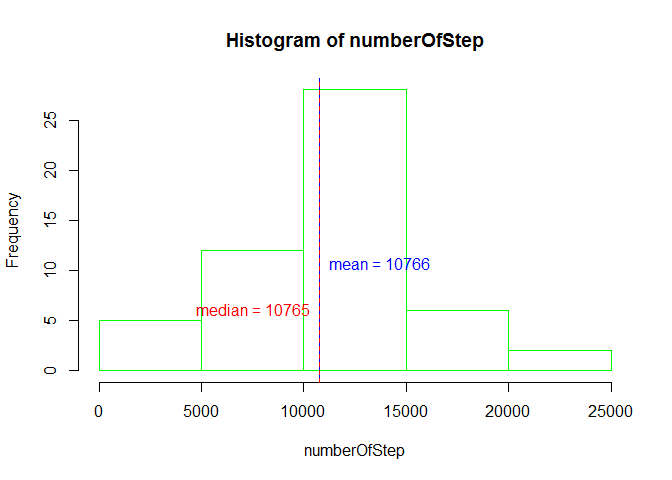
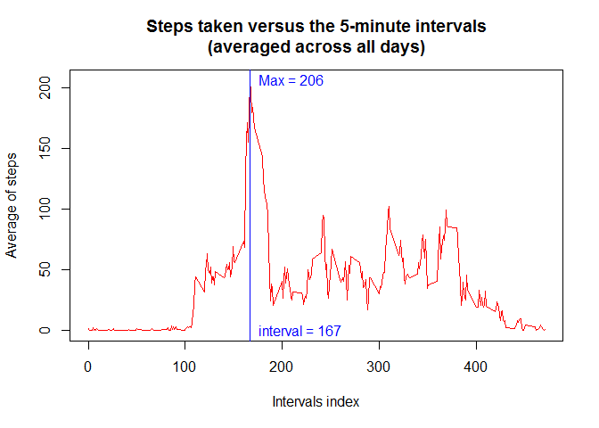
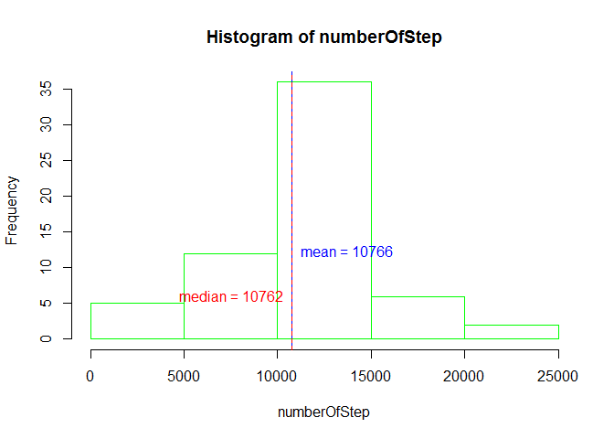
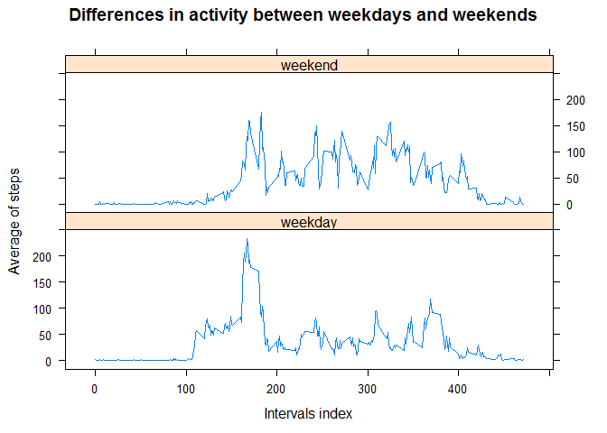

# Reproducible Research: Peer Assessment 1


```r
#loadLibrary
library(lattice)
```

```
## Warning: package 'lattice' was built under R version 3.2.1
```

## Loading and preprocessing the data


```r
zipFile="activity.zip"
dataFile="activity.csv"
#unzip Data File
unzip(zipFile, dataFile)
#Load data
rawActivity <- read.csv(dataFile)
head(rawActivity)
```

```
##   steps       date interval
## 1    NA 2012-10-01        0
## 2    NA 2012-10-01        5
## 3    NA 2012-10-01       10
## 4    NA 2012-10-01       15
## 5    NA 2012-10-01       20
## 6    NA 2012-10-01       25
```

```r
summary(rawActivity)
```

```
##      steps                date          interval     
##  Min.   :  0.00   2012-10-01:  288   Min.   :   0.0  
##  1st Qu.:  0.00   2012-10-02:  288   1st Qu.: 588.8  
##  Median :  0.00   2012-10-03:  288   Median :1177.5  
##  Mean   : 37.38   2012-10-04:  288   Mean   :1177.5  
##  3rd Qu.: 12.00   2012-10-05:  288   3rd Qu.:1766.2  
##  Max.   :806.00   2012-10-06:  288   Max.   :2355.0  
##  NA's   :2304     (Other)   :15840
```

```r
# get Clean Data without NA values
cleanActivity <- rawActivity [ with ( rawActivity , !is.na(rawActivity$steps)), ]
head(cleanActivity)
```

```
##     steps       date interval
## 289     0 2012-10-02        0
## 290     0 2012-10-02        5
## 291     0 2012-10-02       10
## 292     0 2012-10-02       15
## 293     0 2012-10-02       20
## 294     0 2012-10-02       25
```

```r
summary(cleanActivity)
```

```
##      steps                date          interval     
##  Min.   :  0.00   2012-10-02:  288   Min.   :   0.0  
##  1st Qu.:  0.00   2012-10-03:  288   1st Qu.: 588.8  
##  Median :  0.00   2012-10-04:  288   Median :1177.5  
##  Mean   : 37.38   2012-10-05:  288   Mean   :1177.5  
##  3rd Qu.: 12.00   2012-10-06:  288   3rd Qu.:1766.2  
##  Max.   :806.00   2012-10-07:  288   Max.   :2355.0  
##                   (Other)   :13536
```
data is now load:
raw data ar in "rawActivity"
ceal data ear in "cleanActivity"

## What is mean total number of steps taken per day?


```r
#Aggregate number of steps taken per day
numberOfstepsByDay <- aggregate(cleanActivity$steps, by=list(day=cleanActivity$date), FUN = sum)
head(numberOfstepsByDay)
```

```
##          day     x
## 1 2012-10-02   126
## 2 2012-10-03 11352
## 3 2012-10-04 12116
## 4 2012-10-05 13294
## 5 2012-10-06 15420
## 6 2012-10-07 11015
```

```r
# x is the total number of steps taken each day 

# write function to plot a histogram of the total number of steps taken each day
# function plotDailyActivity
# param 1 vector of number of Steps
# return a histogram plot of the total number of steps taken each day
plotHistNumberOfStepsByDay <- function(numberOfStep){

histRes <- hist(numberOfStep, border="green")
# Calculate and report the mean and median of the total number of steps taken per day
meanNumberOfstepsByDay <- mean(numberOfStep)
medianNumberOfstepsByDay <- median(numberOfStep)
  abline(v=meanNumberOfstepsByDay, col = "blue", lty=1) 
  text(x=meanNumberOfstepsByDay, y=mean(histRes$counts), paste("mean", "=", round(meanNumberOfstepsByDay, 0), step=" "), pos=ifelse(meanNumberOfstepsByDay<medianNumberOfstepsByDay, 2, 4), col = "blue")
  abline(v=medianNumberOfstepsByDay, col = "red", lty=2) 
  text(x=medianNumberOfstepsByDay, y=median(histRes$counts), paste("median", "=", medianNumberOfstepsByDay), pos=ifelse(medianNumberOfstepsByDay<meanNumberOfstepsByDay, 2, 4), col = "red")
}
par(mfrow=c(1,1))
plotHistNumberOfStepsByDay(numberOfstepsByDay$x)
```

 
Mean total number of steps taken per day is 10766 steps.

## What is the average daily activity pattern?


```r
head(cleanActivity)
```

```
##     steps       date interval
## 289     0 2012-10-02        0
## 290     0 2012-10-02        5
## 291     0 2012-10-02       10
## 292     0 2012-10-02       15
## 293     0 2012-10-02       20
## 294     0 2012-10-02       25
```

```r
# write function to plot time series  
# function plotDailyActivity
# param 1 vector of Interval index
# param 2 vector of Steps
# return a time series plot of the average number of steps
# return interval Index where activity is maximum

plotDailyActivity <- function(intervalIndex, steps) {
  meanStepsByInterval <- aggregate(steps, by=list(interval=intervalIndex), FUN = mean)
  maxmeanStepsByInterval <- max(meanStepsByInterval$x)
  intervalMaxmeanStepsByInterval <- meanStepsByInterval[which(meanStepsByInterval$x == maxmeanStepsByInterval), c("interval")]
  plot(meanStepsByInterval$interval, y=meanStepsByInterval$x, type = "l", main = "Steps taken versus the 5-minute intervals\n(averaged across all days)", xlab = "Intervals index", ylab = "Average of steps", col = "red")
  abline(v=intervalMaxmeanStepsByInterval, col = "blue")
  textPos <- if (intervalMaxmeanStepsByInterval>mean(meanStepsByInterval$interval)) 2 else 4 
  text(x=intervalMaxmeanStepsByInterval, y=maxmeanStepsByInterval, paste("Max", "=", round(maxmeanStepsByInterval, 0), step=" "), pos=textPos, col = "blue")
  text(x=intervalMaxmeanStepsByInterval, y=0, paste("interval", "=", intervalMaxmeanStepsByInterval), pos=textPos, col = "blue")
  return(intervalMaxmeanStepsByInterval)
}
# run time series plot
maxActivityIntervalIndex <- plotDailyActivity(cleanActivity$interval/5, cleanActivity$steps)
```

 

```r
# write convertion function Minutes2hoursMinutes
Minutes2hoursMinutes <- function(xMinutes){
  return (paste(xMinutes%/%60, xMinutes%%60, sep=":"))
}
Minutes2hoursMinutes(maxActivityIntervalIndex*5)
```

```
## [1] "13:55"
```
the maximum step (206) arrive detween 13:50 and 13:55.

## Imputing missing values


```r
# total number of missing values in the dataset
sum(is.na(rawActivity$steps))
```

```
## [1] 2304
```
number of missing value : 2304

to fill missing values, I insert the mean for that 5-minute interval.

```r
head(rawActivity)
```

```
##   steps       date interval
## 1    NA 2012-10-01        0
## 2    NA 2012-10-01        5
## 3    NA 2012-10-01       10
## 4    NA 2012-10-01       15
## 5    NA 2012-10-01       20
## 6    NA 2012-10-01       25
```

```r
# inserting missing values
cleanActivityMeanByInterval <- aggregate(cleanActivity$steps, by=list(interval=cleanActivity$interval), FUN = mean)
newDs <- merge(rawActivity, cleanActivityMeanByInterval, by="interval")
newDs$steps <- ifelse(is.na(newDs$steps), round(newDs$x,0), newDs$steps)
#srot result 
newDs <- newDs[order(newDs$date, newDs$interval), 1:3 ]
#show new dataset
head(newDs)
```

```
##     interval steps       date
## 1          0     2 2012-10-01
## 63         5     0 2012-10-01
## 128       10     0 2012-10-01
## 205       15     0 2012-10-01
## 264       20     0 2012-10-01
## 327       25     2 2012-10-01
```

```r
# plot histogram of the total number of steps taken each day
numberOfstepsByDay <- aggregate(newDs$steps, by=list(day=newDs$date), FUN = sum)
plotHistNumberOfStepsByDay(numberOfstepsByDay$x)
```

 
Insertin missing values did not impact mean and median number of steps.

## Are there differences in activity patterns between weekdays and weekends?


```r
cleanActivity$week <- ifelse(format(as.Date(cleanActivity$date), "%u") %in% c("6","7"),"weekend","weekday")
meanStepsByIntervalWeek <- aggregate(cleanActivity$steps, by=list(interval=cleanActivity$interval,week=cleanActivity$week), FUN = mean)
  meanStepsByIntervalWeek <- aggregate(cleanActivity$steps,by=list(interval=cleanActivity$interval,week=cleanActivity$week), FUN = mean)
  head(meanStepsByIntervalWeek)
```

```
##   interval    week         x
## 1        0 weekday 2.3333333
## 2        5 weekday 0.4615385
## 3       10 weekday 0.1794872
## 4       15 weekday 0.2051282
## 5       20 weekday 0.1025641
## 6       25 weekday 1.5128205
```

```r
xyplot(meanStepsByIntervalWeek$x~meanStepsByIntervalWeek$interval/5|meanStepsByIntervalWeek$week, , type = "l", main="Differences in activity between weekdays and weekends", xlab = "Intervals index", ylab = "Average of steps", layout=c(1,2))
```

 

```r
Minutes2hoursMinutes(150*5)
```

```
## [1] "12:30"
```

```r
Minutes2hoursMinutes(200*5)
```

```
## [1] "16:40"
```
the max activity is in both cases, centered on 150-200 index (12:30 -16:40) but weekend activity run all along the day.
